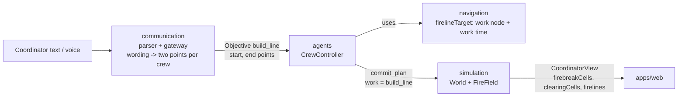

# Firebreaks and fire lines: implementation plan

Goal: crews block the fire. On a coordinator's order, given in plain radio-style text or voice,
one or two crews clear a fire line anywhere on the map, and the fire cannot cross it.

Branch: `firebreak-test`. Status key: `[x]` done and checked, `[ ]` to do.
Every task has an id (track letter + number) and a **check**: the test, command or manual step
that proves it.

Read before working on any track: `AGENTS.md`, `CLAUDE.md`, section 2 (architecture and shared
schema) and your own track brief in section 3.

Contents
1. Scope
2. Architecture and shared schema
3. Tracks (one brief per agent)
4. Waves: what runs in parallel, merge order
5. Done so far
6. Deferred
7. Housekeeping

---

## 1. Scope

**In (Phase 2, the minimal path to blocking the fire anywhere):**
- **Free line placement:** a line runs between two points anywhere on the map. Its start is a named
  place, optionally with an offset ("200 m west of East Junction"). Its course is a place to tie
  in at, or a direction plus a distance ("500 m north", "north to the edge").
- **Who works where:** one crew starts at the line's start; two crews work from opposite ends,
  named by compass ("Crew 1 on the south end") or by place. Each crew starts on its own.
- **One line form everywhere:** two points. Named-place lines and offset lines are turned into
  points by the order gateway; the sim, planner and web never see the wording.
- **Reach 400 m** (unchanged from Phase 1b), sized to the road spacing. On the synthetic map road
  nodes are about 300 m apart (largest gap 510 m), so every point between two neighbouring nodes
  is within reach of one of them; 400 m covers 80% of the synthetic map and 98% of Montclair. Two
  crews can build a line up to 800 m. Trade-off: on the synthetic map a line from East Junction
  north to the map edge (800 m, no road near the edge) can only be built 400 m out.

**Out:**
- **Grid references:** too game-like.
- **A line-drawing tool:** text and voice cover it.
- **Forecasts knowing built lines:** not needed.
- **Walking crews:** crews clear from their end's road node, as in Phase 1b. This also removes the
  need for planning from off-road positions.

**Deferred:** early finish, partner awareness, status queries, tile inspection, metrics and
balance (section 6).

---

## 2. Architecture and shared schema

### 2.1 Data flow



Who decides what:
- **communication** turns words into points and crew assignments. It never checks feasibility.
- **agents** decide whether a crew can do it safely (forecast + planner) and commit the plan.
- **simulation** is the only place world state changes.
- **web** draws what the view says.

### 2.2 In place now (Phase 1b, contract v1)

Kept as is:
- `PublicMap.firebreakCells`.
- `MapNode.name` (junction names).
- `FireField.clearance` and `applyClearance`.
- The spread rules (partial clearance slows spread; diagonal steps between cleared corners are
  blocked; refuges unchanged).
- `CoordinatorView.firebreakCells` and `clearingCells`.
- `lineWorkPerCell` 15, `lineWorkRate` 1.

Replaced by contract v2:
- The node-to-node line form: `MissionWork.build_line { fromNodeId, toNodeId }`,
  `ObjectiveConstraints.line { fromNodeId, toNodeId }` and `CoordinatorFirelineView.fromNodeId/toNodeId`.
- Intent `fromName/toName/assignments`.

Nothing outside this branch uses the node form, so this is a replacement, not a second form.

### 2.3 Contract v2 (Track A writes this first)

`packages/domain/src/records.ts`
```ts
// The crew clears from `start` toward `end`, working from road node `workNodeId`.
z.object({
  kind: z.literal("build_line"),
  workNodeId: NodeId,
  start: MapPoint,
  end: MapPoint,
})

// The crew's end is `start`; the planner picks its work node.
ObjectiveConstraints.line?: { start: MapPoint; end: MapPoint }
```

`packages/domain/src/coordinator-view.ts`
```ts
CoordinatorFirelineView = {
  id: string;              // firelineId(start, end), same for both directions
  start: MapPoint;         // canonical order (see firelineId)
  end: MapPoint;
  cells: number[];         // start -> end
  resolved: boolean;       // no unburned cell left
}
```

`packages/communication/src/intent.ts`: the order as words; the gateway resolves it
```ts
objective (kind "line"): {
  anchor: { placeName: string; offsetMeters?: number; offsetDirection?: CompassDirection };
  course:
    | { kind: "to_place"; placeName: string }
    | { kind: "heading"; direction?: CompassDirection; bearingDeg?: number;
        lengthMeters?: number /* default 200 */; toEdge?: boolean };
  crews?: { recipient: string; end: EndRef }[];   // absent: the addressed crew takes the start
}
type EndRef = "start" | "far" | { compass: CompassDirection } | { placeName: string };
Directory.places: { id: NodeId; name: string; x: number; y: number }[]
```

`packages/simulation/src/model/firelines.ts`: shared helpers (sim, navigation, gateway)
```ts
export const DEFAULT_LINE_LENGTH_M = 200;
anchorPoint(place: { x; y }, offsetMeters: number, direction: CompassDirection): { x; y } | null;  // null off the map
lineEnd(start: { x; y }, bearingDeg: number, lengthM: number | "edge"): { end: { x; y }; clampedToEdge: boolean };
compassBearing(direction: CompassDirection): number;    // north 0, east 90 (world north = +y)
firelineCells(start: { x; y }, end: { x; y }): number[];      // 8-connected, start -> end
firelineId(start: { x; y }, end: { x; y }): string;          // "line:<cellA>~<cellB>", cellA <= cellB
reachableFirelineCells(road, workNodeId, start, end, reachM = lineReachM): number[];
```
`SIM_DEFAULTS.lineReachM` stays **400** (section 1).

Contract tests:
- Each objective form parses.
- `lineEnd` uses 200 m by default and shortens at the edge, reporting `clampedToEdge`.
- Bearings: north 0, east 90.
- `firelineId` is the same in both directions.
- `anchorPoint` returns null off the map.

### 2.4 Order language (authoritative for Track D)

An order names the **anchor**, the **course**, and optionally **which crew takes which end**:

| Order | Start | End | Crews |
|---|---|---|---|
| "Crew 1, cut line from Waterworks to Ridge Cabins." | Waterworks | Ridge Cabins | Crew 1 at Waterworks |
| "Crew 1, anchor at East Junction and cut line north to the edge." | East Junction | north map edge | Crew 1 at the start |
| "Crew 1 and Crew 2, cut line from 200 m west of East Junction, 500 m north. Crew 1 on the south end, Crew 2 on the north end." | 200 m west of East Junction | 500 m north of the start | Crew 1 south end (start), Crew 2 north end |
| "Crew 1, start 150 meters north of Waterworks, cut line bearing 030 for 400 meters." | 150 m north of Waterworks | 400 m on bearing 030 | Crew 1 at the start |
| "Crew 1 and Crew 2, cut line from Waterworks to Ridge Cabins, work toward each other." | Waterworks | Ridge Cabins | Crew 1 start, Crew 2 far end |

Rules:
- **Places** are directory places: sites, refuges, named junctions. **Offsets** are "<N> m
  <direction> of <place>".
- **Directions** are world compass points (north = increasing map `y`, the same as move orders), or
  bearings in degrees clockwise from north. At the start of an incident north is at the bottom of
  the screen, and the on-screen compass tracks it as the camera turns.
- **Length:** 200 m if none is given. A line that would cross the map edge is shortened to stop
  there, and the reply says so. "To the edge" asks for exactly that.
- **Ends:**
  - "start" / "far end".
  - A compass end: the end further in that direction. If both ends are equally far, as for "north
    end" on an east–west line, the gateway asks.
  - A place, which must be one of the line's ends.

  Screen words ("top", "bottom") are not accepted: the server cannot see the camera.
- **Crews without ends:** one crew takes the start; two crews take start and far end in the order
  named.
- **Spoken forms** parse the same: "two hundred meters", "bearing zero three zero".
- **Unclear orders get a question back:** an unknown place, a missing course, an anchor off the map,
  or an ambiguous end.
- **Reply:** one line per crew, naming its end in words, e.g. "Sent to Crew 2: cut line from the
  north end toward the south end (500 m, shortened at the map edge)."
- **"Hold the line"** stays a containment order.

### 2.5 Crew rule (authoritative for Track C)

- **Work node:** the crew's work node is the nearest road node to its end that lies within
  `lineReachM` (400 m) of that end.
- **No road nearby:** refuse with `no_road_near_line_end`. The reply suggests both crews take the
  other end.
- **What it clears:** from its end toward the other, the first unburned cell in order that lies
  within `lineReachM` of its work node. Two crews meet in the middle.
- **Shift length:** the longest work time the forecast admits; one shift per order, as in Phase 1b.

### 2.6 Invariants every track keeps

- **Determinism:** crews are processed in `World.agents` order. No randomness, wall clock or
  unordered-map iteration in the sim.
- **Time:** `simTimeMs` and `wallElapsedMs` are never compared raw.
- **Privacy:** no private world parameters in any projection, view or message. Line work is public.
- **Cell lists** in views are sorted and unique (`firelines[].cells` excepted, which runs start to
  end). `clearance` is strictly between 0 and 1.
- **Parsing:** cross-boundary data is parsed with the Zod schemas. Contract changes go through
  Track A.

---

## 3. Tracks (one brief per agent)

Edit only your **owned paths**. If you need something outside them, ask Track A instead of editing.

| Track | Owns | Lane |
|---|---|---|
| A: contract + integration | `packages/domain/**`, helper signatures in `packages/simulation/src/model/firelines.ts`, `apps/server/src/main.ts`, `http-app.ts`, `incident-registry.ts` | shared / sim |
| B: simulation | rest of `packages/simulation/**`, `packages/forecast/**` | sim |
| C: crews | `packages/navigation/**`, `packages/agents/**` | sim |
| D: orders | `packages/communication/**`, `apps/server/src/conversation.ts`, `apps/server/src/xai/chat.ts` | sim |
| E: web | `apps/web/**` | web |

### Track A: contract and integration
- **Mission:** ship contract v2 (2.3) with tests and helper implementations, then integrate.
- **Starts:** immediately. Everyone else starts when A1 merges.
- [ ] **A1. Contract v2:** schema, helpers, and Phase 1b code moved onto the new
  form so everything compiles. Check: contract tests (2.3); full checks green.
- [ ] **A2. Integration:** rebase the tracks; full checks; live run with the three example orders
  in 2.4, including the two-crew one. Check: lines appear where ordered, crews start from the
  ends named, and the fire stops at a finished line.

### Track B: simulation
- **Mission:** the world builds two-point lines.
- **Must not touch:** agents, navigation, communication, `apps/**`.
- [ ] **B1. World builds point lines:** register by `firelineId`; validate the plan's work node is
  where the crew stands at work time and lies within reach of its end; clear per 2.5; emit
  `fireline_resolved`. Check: `firelines.test.ts` rewritten for points, including two crews from
  opposite ends and a line clamped at the edge.
- [ ] **B2. View:** `firelines` with points; `firebreakCells` and `clearingCells` unchanged.
  Check: incident view test.
- [ ] **B3. Determinism:** seeded-run and replay tests unchanged; a two-crew line run gives the
  same view twice. Check: tests.

### Track C: crews
- **Mission:** crews plan and accept point-line orders.
- **Must not touch:** `packages/simulation/src/world.ts`, communication, `apps/**`.
- **Stub:** until B lands, use the A1 helpers and a fake incident in tests.
- [ ] **C1. Line target:** work node per 2.5; work time from reachable cells × 15 s; refuse with
  `no_road_near_line_end`. Check: navigation test (near a road accepted; far from one refused).
- [ ] **C2. Controller:** handle `build_line` with points; report the crew's end in words ("cutting
  line from the north end toward East Junction"); one shift per order. Check:
  `agents/src/firelines.test.ts` rewritten.

### Track D: orders
- **Mission:** the order language in 2.4, typed or spoken.
- **Must not touch:** sim, agents, web.
- [ ] **D1. Directory:** places with coordinates (sites, refuges, named junctions). Check: server test.
- [ ] **D2. Scripted parser:** anchor, offset, course, crews and ends, including spoken numbers and
  bearings. Check: interpreter tests for every row in 2.4, plus the "hold the line" case.
- [ ] **D3. Gateway:** words → two points per crew with the A1 helpers; clarifications; replies per
  2.4. Check: gateway tests (default 200 m, clamped reply, ambiguous end, unknown place, two crews).
- [ ] **D4. Grok prompt:** describe the new objective shape; one manual check with an API key using
  the 2.4 examples.

### Track E: web
- **Mission:** show point lines; teach the order language.
- **Must not touch:** anything outside `apps/web`.
- **Stub:** fixture views with point-based `firelines`.
- [ ] **E1. Point lines:** planned, clearing and cleared tiles from `firelines` with points.
  Check: `sceneEntities.test.ts`.
- [ ] **E2. Order help:** a short "How to order a fire line" note near the message box, with two
  examples and a reminder that directions follow the compass. Check: component test.

---

## 4. Waves: what runs in parallel, merge order

| Wave | Runs in parallel | Blocks on | Merges into |
|---|---|---|---|
| 0 | A1 contract v2 | nothing | `lane/sim` (web rebases) |
| 1 | B1–B3, C1–C2, D1–D4, E1–E2 | wave 0 | B, C, D → `lane/sim`; E → `lane/web` |
| 2 | A2 integration | wave 1 | Andrew merges lanes into `main` |

Merge rules:
- **Wave 1 tracks touch disjoint packages,** so they merge in any order. Each rebases first and
  merges with CI green.
- **Mid-wave contract changes go through A** as a small follow-up PR. Nobody else edits `packages/domain`.
- **Full checks before every merge:** `pnpm --filter "./packages/**" build`, then
  `pnpm -r typecheck`, `pnpm lint` and `pnpm test`.

All four wave-1 tracks are small, so one agent can also do them in order (B, C, D, E) if parallel
agents aren't available.

**Risk to check first in A2:** crews may refuse line orders close to the fire because of forecast
safety margins. If they refuse the lines that matter, tune the margins; it needs no new
architecture.

---

## 5. Done so far

### Phase 0: feasibility
- [x] Hand-placed firebreak experiment over 10 seeds. Check: `firebreak-feasibility.test.ts`.
- [x] Findings: an anchored 40-cell line built by about 500 s cuts burned area about 20% and saves Ridge
  Cabins in all 7 seeds where it was hit; 45 s/cell is overrun; ~15 s/cell works; rings give total
  immunity (balance risk); nothing extinguishes the fire.

### Phase 1a: hand-placed firebreaks (commit `a8de916`)
- [x] Map firebreaks never ignite; validation; presets via `EMBER_FIREBREAK`; forecasts include
  them; web tiles and legend. Check: `firebreaks.test.ts`, `firebreak-contract.test.ts`,
  `forecast/src/firebreak.test.ts`, web scene tests.

### Phase 1b: partial clearance, built lines, diagonal gaps (commit `e097f4f`)
- [x] Partial clearance slows spread; full clearance makes a firebreak.
  Check: `model/clearance.test.ts`.
- [x] Diagonal steps between cleared corners blocked; refuges unchanged. Check: same file.
- [x] Node-to-node lines built from both ends; crews take the longest safe shift; two-crew orders by
  text; web shows planned, clearing and cleared cells and junction names. Check:
  `firelines.test.ts`, `agents/src/firelines.test.ts`, `communication/src/firelines.test.ts`, web
  scene tests.
- [x] Full checks green (1,109 tests). Live run: two crews built the East Junction to Ridge Cabins
  line from both ends.

Contract v2 (A1) replaces Phase 1b's node-to-node form; the clearance and diagonal rules stay.

---

## 6. Deferred

Specified but not scheduled. Pick up after Phase 2 if time allows.

- **Early finish:** crews return as soon as their part is done, instead of at shift end.
- **Partner awareness:** a crew plans for its half when another crew holds the other end.
- **Queries:** "status of the line". (Pulling a crew off already works: "Crew 2, return".)
- **Web extras:** tile inspection with clearance %; line labels with progress.
- **Metrics and balance:** burned and saved area in `RunMetrics` and the end screen; sweeps of
  `lineWorkPerCell` and `lineReachM` on held-out seeds.
- **Grok fixtures:** recorded model outputs as tests (D4 does one manual check instead).

---

## 7. Housekeeping

- [x] **H1.** Commit Phase 1b on `firebreak-test` before A1 starts. Done: `e097f4f`.
- [ ] **H2.** Split into lane PRs: domain + sim-lane packages + server into `lane/sim`; `apps/web`
  into `lane/web`. Check: CI green on both.
- [ ] **H3.** Docs (human-authored, Andrew): `docs/SIMULATION.md:80`, `EMBER_LINE.md:113` and
  `CONTEXT.md:132` still say there is no suppression that changes spread.
- [ ] **H4.** Fix `pnpm build:libs` on Windows: the `'./packages/**'` filter matches nothing there;
  double quotes work on both. Shared root `package.json`, so agree with Andrew.
- [ ] **H5.** Keep `.claude/launch.json` local or commit it.
