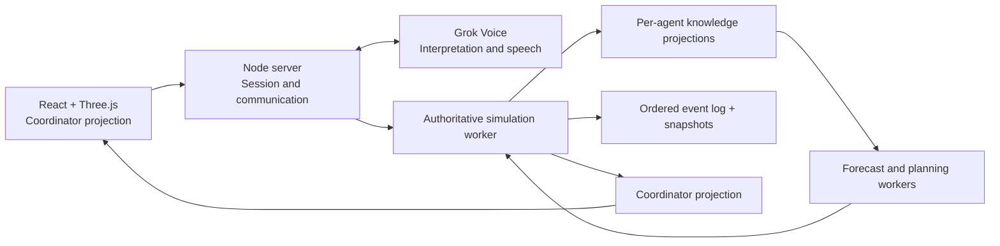

# Architecture

## Decision

Use one TypeScript application with a server-owned simulation and isolated planning jobs. Simulated agents are independent state machines with their own knowledge, objectives, and forecasts. They do not require separate servers or an LLM call on every tick.

The language model interprets communication. Deterministic code owns evidence admission, movement, task progress, damage, feasibility, reservations, and terminal outcomes. The Three.js frontend renders a filtered projection and sends communication input.

## Runtime shape



Stack in repo: React 19, `@react-three/fiber` 9, Three.js, Vite, Node.js 22+, TypeScript strict, WebSocket transport (`ws`), Zod from `@ember/domain`, pnpm workspace with `pnpm-lock.yaml`. `apps/server/src/main.ts` starts the Fastify HTTP + WebSocket application in `http-app.ts`; `hub.ts` owns the live pump. `ws-server.ts` remains a secondary loopback-only WebSocket entrypoint. Vitest covers model and server tests; Playwright is specified for browser scenarios but not yet wired in CI.

Run locally first. Package one server process serving the built browser app and handling WebSockets; use workers inside that process. A single long-lived deployment container is sufficient for the MVP. Do not introduce a database, message broker, Kubernetes, or serverless per-tick functions.

## Module ownership

| Module | Owns | Must not own |
|---|---|---|
| `domain` | IDs, units, schemas, scenario configuration | Provider APIs or rendering |
| `simulation` | Truth state, clock, motion, fire, damage, end conditions | LLM requests |
| `knowledge` | Observation history and scoped projections | Implicit global synchronization |
| `forecast` | Candidate futures conditioned on one knowledge snapshot | Hidden world state or truth seed |
| `agents` | Objectives, lifecycle, independent selection, explanations | Coordinator omniscience |
| `navigation` (includes reservations) | Complete timed mission search, segment occupancy, time allocations | Other agents' fire beliefs |
| `communication` | Recipient resolution, evidence references, command validation, audio priority | Feasibility overrides |
| `web` | Three.js presentation and accessible DOM controls | Authoritative world advancement |
| `replay` | Recorded state/decision playback and evaluation export | Re-running LLM calls |

Suggested repository layout:

```text
apps/web/
apps/server/
packages/domain/
packages/simulation/
packages/knowledge/
packages/forecast/
packages/navigation/
packages/agents/
packages/communication/
packages/replay/
scenarios/
tests/fixtures/
docs/
```

These directories exist in the monorepo. Keep public module interfaces narrow; avoid a shared object that exposes the entire world. Timed segment **reservations** are implemented inside `packages/navigation`, not a separate package.

## State and contracts

Use integer simulated milliseconds, integer sequence numbers, and meters in the local scene coordinate system. Distinguish `wallElapsedMs` from `simTimeMs` everywhere.

| Record | Required fields |
|---|---|
| Scenario | version, public map/briefing, private world parameters, configuration hash |
| Agent | id, role, position on edge or node, state, objective revision, knowledge revision, plan revision |
| Site | id, requiredWork, completedWork, damage, value, destroyed flag |
| Observation | id, sourceAgentId, observedAt, receivedAt, spatial footprint, observed fields |
| Evidence reference | kind (sensor observation or agent report), source record ID, source agent, timestamp; forecast statements retain their type |
| Objective | id, recipientId, kind, targetId, constraints, issue sequence |
| MissionPlan | id, recipientId, knowledge revision, timed legs, work interval, refuge, reservation revision, limiting scenario/reason |
| DecisionEvent | sequence, tick, agentId, type, reasonCode, evidenceIds, actual action |
| CommandReceipt | commandId, status, recipientId, appliedTick, explanation, plan revision |
| IncidentEnd | tick, wallElapsedMs, all matching reasons, display reason, final snapshot hash |

Positions on roads include an edge ID, distance along its polyline, direction, and turnaround time remaining. Never reconstruct actual position from the most recent route endpoint.

Public simulation interfaces:

```ts
createIncident(config, privateWorldSeed): IncidentHandle
advance(handle, dueTicks): DomainEvent[]
enqueueCommand(handle, validatedCommand): CommandReceipt
projectCoordinator(handle): CoordinatorView
projectAgent(handle, agentId): AgentKnowledgeSnapshot
evaluateMission(input: ScopedPlanningInput): PlanResult
replay(log, scenarioVersion): ReplayResult
```

The table above is the contract shape. In code, `Incident` in `@ember/simulation` is the authoritative handle; replay uses `replayRecord` / bundle readers and `revealFire` in `@ember/replay` rather than a single `replay(log)` that rebuilds truth from events alone. Session-level wiring lives in `apps/server`.

## Event order and concurrency

The simulation worker alone mutates world state. Worker results and provider messages enter an ordered inbox. At a tick boundary, validate each result against current objective, knowledge, reservation, and position revisions. A stale result may provide reusable candidate geometry, but cannot be committed without current feasibility checks.

Forecast work runs outside the authoritative tick. Cache immutable outputs by knowledge/configuration hash. Sharing a cache is allowed only when the complete input is identical. Coalesce obsolete jobs; emergency local observation handling never waits behind routine forecasting.

Each accepted command has an idempotency key. Retries return the original receipt and do not apply work or objectives twice. Acknowledged receipt means “received”; only a later accepted receipt means the planner adopted the objective.

Keep safety-triggered actions ordered before optional task selection. Each tick's physical changes are logged before testing end conditions. After ending, reject gameplay commands with `INCIDENT_ENDED`.

## Knowledge enforcement

Public starting information includes terrain, road geometry, crew capabilities, site names/initial values, refuges, and the initial briefing observation. It excludes future wind, latent spread parameters, truth random state, and actual remote fire.

Own-position telemetry and self-reported agent status may update the coordinator automatically. Fire/site observations are separately timestamped evidence. Other agents do not receive telemetry or reports unless the coordinator sends relevant information; reservation availability is the narrow exception.

The coordinator serializer must whitelist fields. Do not send the private world and hide it with CSS or a fog layer. Active-run API routes cannot request truth, replay snapshots, or another agent's private knowledge. Replay truth becomes available only for an ended run.

## Browser/server transport

### Target HTTP/WebSocket contract

- `POST /incidents`: instantiate scenario and return briefing projection.
- `POST /incidents/:id/start`: idempotently begin the five-minute clock.
- `WS /incidents/:id/events`: versioned snapshots, deltas, receipts, observations, reports, and audio metadata.
- `POST /incidents/:id/messages`: typed input with command ID and recipient context.
- `WS /incidents/:id/voice`: microphone chunks, capture start/end, and synthesized audio.
- `GET /incidents/:id/replay`: ended-run log and authorized truth snapshots.
- `GET /health`: server readiness, with no secrets.

Authenticate each connection with an unguessable session token issued for that incident; do not use a globally accessible demo state. Keep provider keys server-side. Validate message shapes and cap text/audio sizes before provider or planner work.

Send state at 5 Hz with sequence numbers; publish critical reports immediately between regular snapshots. Reconnect requests a fresh snapshot and resumes from the last acknowledged event. If the browser disconnects, the incident continues. Commands that arrive after the deadline are not applied.

### As implemented (2026-10-03)

- **Live server:** one loopback WebSocket per `startServer()` session; JSON messages in `apps/server/src/protocol.ts` (`say`, push-to-talk, `inspect`, coordinator `view`, transcript, receipts, audio notices). Pump interval 200 ms; outbound views are full `CoordinatorView` snapshots validated against domain schemas. Message size capped at 64 KiB.
- **Web client:** `CoordinatorViewClient` validates every frame; mock incident socket and recorded replay for offline UI; optional `POST /incidents/:id/start` when a REST base URL is configured.
- **Not yet:** multi-incident HTTP API, session tokens, separate voice socket, delta encoding at 5 Hz, `GET /replay` from server. See [SERVER_AND_EVALUATION.md](SERVER_AND_EVALUATION.md).

## Persistence and replay

Write an append-only JSONL event log and a compact snapshot every 25 simulation ticks. Store scenario/configuration hashes, world seed in private replay metadata, independent random-stream states, accepted/rejected commands, provider interpretation outputs, and actual application ticks.

Replay reads recorded events and outputs. It does not query Grok, infer past user intent again, or assume network timing can be recreated. Deterministic headless reruns consume recorded command application ticks. Voice recordings are not required for reproducibility; store transcripts and event-linked text by default, with short-lived in-memory microphone buffers.

Single-process memory is authoritative during play; JSONL supports post-run replay and debugging, not transparent crash recovery. A server crash invalidates that run. Do not manufacture a successful ending or silently restart its clock.

## Runtime limits

Target one active demo incident initially. An authoritative tick must finish inside 200 ms of wall time; target p95 under 20 ms excluding independent forecast jobs. Target forecast/replan results under 500 ms p95 on the documented test machine. These targets require benchmarks.

If worker queues grow, discard superseded jobs and reduce decorative client rendering first. A controller with an unavailable or invalid forecast cannot start protection work. Prolonged server lag is a technical failure recorded outside normal gameplay results, not a fifth in-world ending condition.
